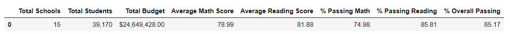
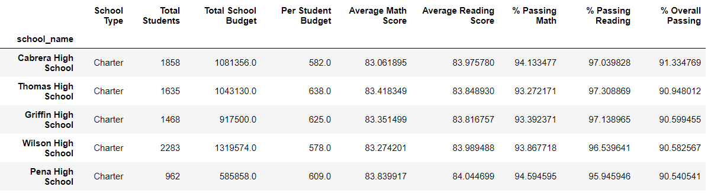
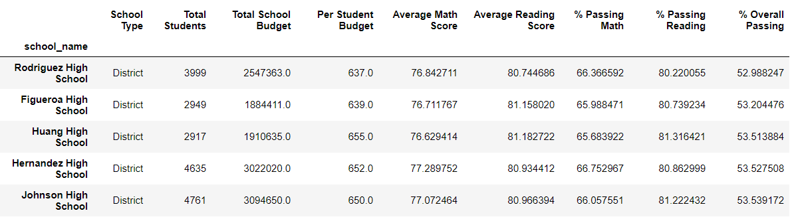
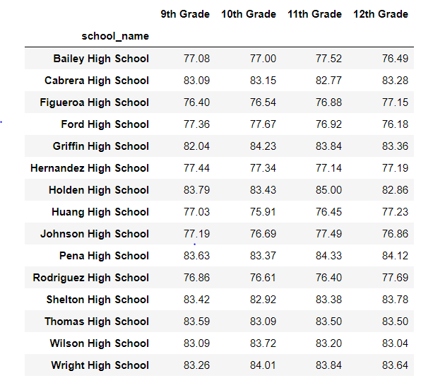
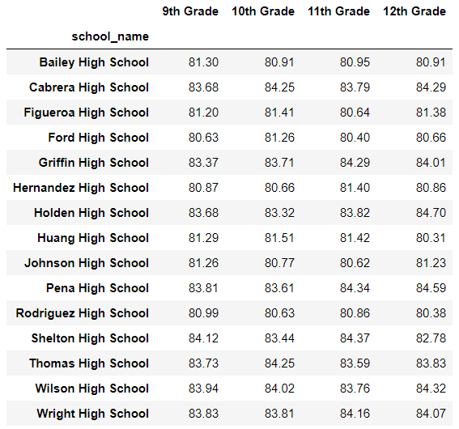
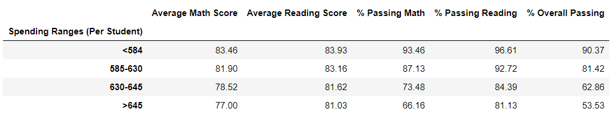
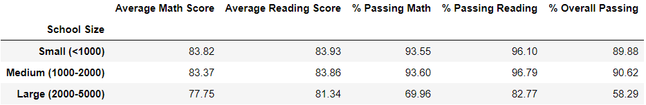
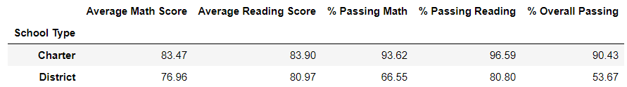

# Pandas-Challenge City Schools

## Background

This project usings pandas and jupyter notebook to analyze the district-wide standardized test results.  Using two datasets in csv format including [students_complete.csv](PyCitySchools/Resources/students_complete.csv), which includes info on student scores, gender, and grade, and the [schools_complete.csv](PyCitySchools/Resources/schools_complete.csv).

## Analysis

#### Import Dependencies

	# Dependencies and Setup
	import pandas as pd

#### Load, Read, and Merge Data files

	# File to Load
	school_data_file = "Resources/schools_complete.csv"
	student_data_file = "Resources/students_complete.csv"

	# Read School and Student Data File and store into Pandas DataFrames
	school_df = pd.read_csv(school_data_file)
	student_df = pd.read_csv(student_data_file)

	# Combine the data into a single dataset
	school_data = pd.merge(student_df, school_df, how="left", on=["school_name", "school_name"])

### District Summary

* Create a summary table describing the following results

	* Total Schools
  	* Total Students
  	* Total Budget
  	* Average Math Score
  	* Average Reading Score
  	* % Passing Math (The percentage of students that passed math.)
  	* % Passing Reading (The percentage of students that passed reading.)
  	* % Overall Passing (The percentage of students that passed math and reading.)

###### School Summary

* Create a summary table describing the following results:

  	* School Name
  	* School Type
  	* Total Students
  	* Total School Budget
  	* Per Student Budget
  	* Average Math Score
  	* Average Reading Score
  	* % Passing Math (The percentage of students that passed math.)
  	* % Passing Reading (The percentage of students that passed reading.)
  	* % Overall Passing (The percentage of students that passed math and reading.)

###### Top 5 Best Performing Schools (By % Overall Passing)

###### Top 5 Worst Performing Schools (By % Overall Passing)

###### Average Math and Reading Scores by each Grade per School

*  Average Math Scores

*  Average Reading Scores

##### Scores by School Spending, School Size, and School Type

  * Average Math Score
  * Average Reading Score
  * % Passing Math (The percentage of students that passed math.)
  * % Passing Reading (The percentage of students that passed reading.)
  * % Overall Passing (The percentage of students that passed math and reading.)

